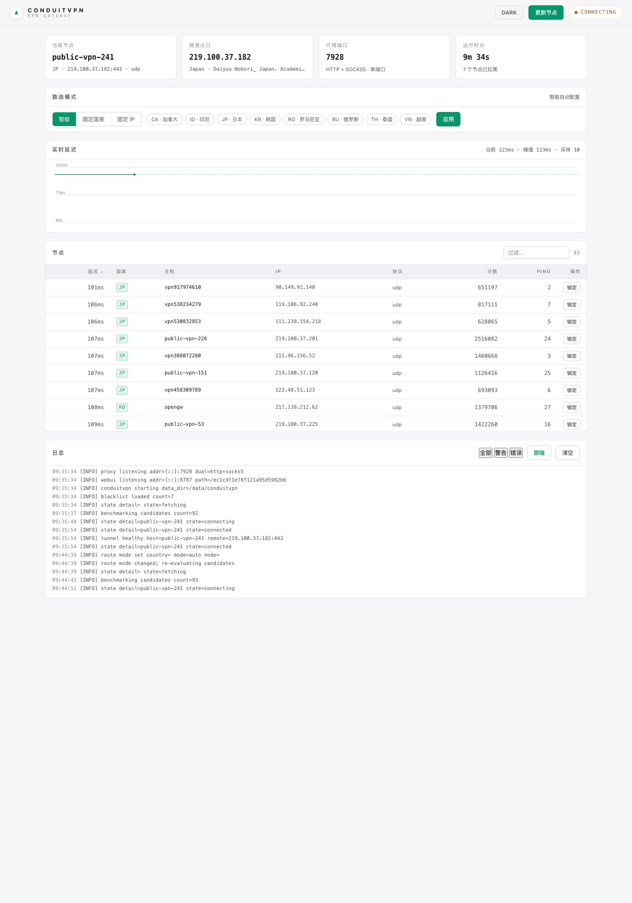
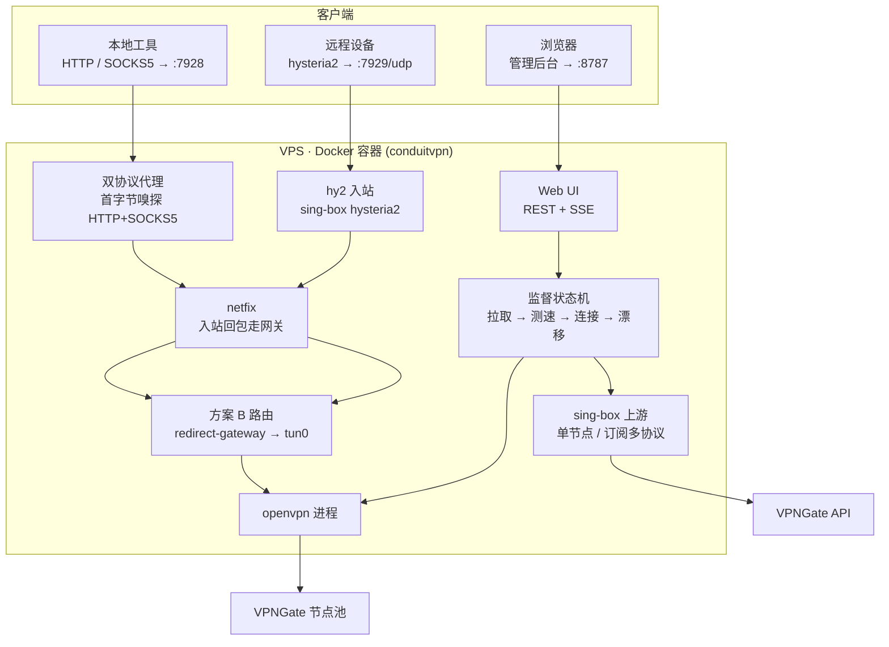

# ConduitVPN

一个高性能的 VPNGate 代理网关管理器，用 Go 编写，**零第三方依赖**（纯标准库）。

它把 VPNGate 的公共 OpenVPN 节点变成一个**常驻的代理网关**：自动拉取节点、并发测速、智能选路、健康监测、故障自动漂移，并对外提供 HTTP / SOCKS5 / hysteria2 多协议入口和带 Web 管理后台的实时监控。

> 原项目为 Python 版 aimili-vpngate（GPL-3.0）。本仓库是独立的 Go 重写版。

---

## 📸 界面预览



- 顶部状态卡片：当前节点 / 隧道出口 / 代理端口 / 运行时长
- 路由模式：智能自动 / 固定国家地区（多选）/ 固定 IP（一键锁定）
- 实时延迟图表：后台每 10s 实测当前节点延迟
- 节点表：延迟 / 国家地区 / 主机 / IP / 协议排序与过滤
- 日志流：SSE 实时滚动，级别过滤

---

## 🏗️ 架构



### 核心设计

**方案 B（全隧道）**：openvpn 使用服务端推送的 `redirect-gateway`，容器默认路由走 `tun0`。相比 Python 原版的方案 A，砍掉了三个子系统（策略路由、`SO_BINDTODEVICE`、tun0 自定义 DNS），代价是入站服务的回包会被送进 VPN——由 **netfix**（connmark 标记入站连接 → 回包走 docker 网关）修复。

**监督状态机**：单协程独占隧道生命周期。

```
IDLE → FETCHING(拉取+测速) → CONNECTING(拉起 openvpn) → CONNECTED → PROBING → STABLE
     ↕ 节点失效/探测连败/模式变更 → 拉黑 → 漂移至下一个
```

### 模块布局

```
cmd/conduitvpn/          入口：netfix + hy2 + proxy + webui + manager 装配
internal/
├── vpngate/             API 拉取（支持上游代理）+ CSV 解析 + base64 解码
├── upstream/            sing-box 引擎：vmess/vless/trojan/ss/hy2 URI + 订阅解析
├── hy2/                 hysteria2 入站网关（自签证书 + 进程管理）
├── benchmark/           并发测速池
├── tunnel/              openvpn 子进程管理（握手解析/优雅停止/进程回收）
├── health/              HTTPS 探测（硬编码 IP，零 DNS 依赖）
├── manager/             监督状态机 + 路由模式筛选 + 实时延迟测量
├── proxy/               单端口双协议（HTTP+SOCKS5）+ 隧道内 DNS
├── netfix/              方案 B 回包路由修复（TCP/UDP connmark）
├── state/               JSON 原子持久化（节点/黑名单/路由/UI secret）
├── logx/                分级 JSON 日志 + 环形缓冲 + SSE 订阅
└── webui/               REST + SSE + 安全后缀 + embed 静态资源
```

---

## ✨ 功能特性

| 功能 | 说明 |
| --- | --- |
| 节点管理 | 自动拉取 VPNGate 节点列表，并发测速排序 |
| 三种路由模式 | 智能自动（失效自动漂移）/ 固定国家地区（多选）/ 固定 IP（锁定单节点），运行时切换 |
| 自动漂移 | 节点失效数秒内自动切换备用节点；固定模式持续重试锁定节点 |
| 多协议入站 | HTTP + SOCKS5 单端口双协议（7928）、可选 hysteria2（7929/udp） |
| hy2 远程接入 | 手机/Mac 等远程设备用 hy2 客户端连入，流量经 VPN 节点出口 |
| 健康探测 | 硬编码 IP HTTPS 探测，连续 3 次失败触发漂移 |
| 实时监控 | 每 10s 实测节点延迟，Web UI 折线图展示 |
| sing-box 上游 | 拉取 API 时可走 vmess/vless/trojan/ss/hy2 单节点或订阅链接 |
| 双主题 UI | 深色 / 浅色，安全后缀 URL，SSE 实时日志 |
| 单静态二进制 | CGO_ENABLED=0，镜像约 29MB（含 openvpn + sing-box） |

---

## 🚀 快速开始

### 一键部署（Docker）

```bash
UI_USER=admin \
UI_PASSWORD='至少16字符的随机密码' \
LOCAL_PROXY_USER=proxy \
LOCAL_PROXY_PASS='至少16字符的随机密码' \
bash install.sh
# 可选：hy2 入站
HY2_PORT=7929 HY2_PASSWORD='至少16字符的随机密码' bash install.sh
```

脚本会：构建多阶段镜像 → 以最小 `NET_ADMIN` 能力、只读根文件系统和 `/dev/net/tun` 启动容器 → 将后台仅发布到宿主机回环地址。

### 手动运行

```bash
docker run -d --name conduitvpn \
  --restart unless-stopped \
  --cap-drop=ALL --cap-add=NET_ADMIN --security-opt=no-new-privileges \
  --read-only --tmpfs /tmp --device=/dev/net/tun \
  -v /data/conduitvpn:/data/conduitvpn \
  -p 127.0.0.1:8787:8787 \
  -p 127.0.0.1:7928:7928 \
  -p 0.0.0.0:7929:7929/udp \   # 可选 hy2
  -e UI_HOST=0.0.0.0 -e UI_USER=admin -e UI_PASSWORD='至少16字符的随机密码' \
  -e LOCAL_PROXY_HOST=0.0.0.0 -e LOCAL_PROXY_USER=proxy -e LOCAL_PROXY_PASS='至少16字符的随机密码' \
  -e HY2_PORT=7929 -e HY2_PASSWORD='至少16字符的随机密码' \
  ghcr.io/sarices/conduitvpn:latest
```

镜像发布在 GitHub Container Registry，CI 每次推送自动构建 amd64/arm64。

### UI 演示模式

本地调试前端或演示管理后台时，可不安装 OpenVPN、无需 TUN 设备直接启动：

```bash
go run ./cmd/conduitvpn --demo
```

demo 模式只启动 Web UI，并使用模拟节点、状态、日志和路由操作；不会创建 VPN 隧道，也不提供 HTTP、SOCKS5 或 hysteria2 代理服务。首次运行默认将数据写入 `./.conduitvpn-demo`，后台账号为 `admin`、密码为 `demo`；启动日志会输出随机安全后缀访问地址。可通过 `CONDUIT_DATA_DIR`、`UI_USER`、`UI_PASSWORD` 覆盖这些默认值。

在线 demo：https://conduitvpn.akshop.indevs.in/

---

## 🖥️ 使用指南

### Web 管理后台

访问 Cloudflare Tunnel 或本机反向代理暴露的后台地址进行登录。生产部署必须提供显式管理员凭据：

- **显式管理员凭据**：首次生产启动必须设置 `UI_USER` / `UI_PASSWORD`（密码至少 16 字符）；密码以加盐 PBKDF2 哈希保存。旧版 `ui_auth.json` 会自动迁移。
- **TLS 可选**：可通过 `UI_TLS_CERT` 与 `UI_TLS_KEY` 启用原生 TLS；使用 Cloudflare Tunnel 时，Compose 应仅将 UI 端口发布到宿主机回环地址。
- **安全后缀**：访问路径为随机 24 位十六进制，root 返回 404，不泄露入口
- **会话**：登录后下发 HttpOnly、SameSite=Strict 会话 Cookie（12 小时），服务端内存会话
- **退出**：面板内有登出入口（`POST /api/logout`）

### 本地代理

```bash
export http_proxy="http://127.0.0.1:7928"
export https_proxy="http://127.0.0.1:7928"
curl --socks5 127.0.0.1:7928 https://api.ipify.org
```

7928 端口默认仅绑定宿主机回环，不对外暴露。

### hy2 远程接入

```bash
HY2_PORT=7929 HY2_PASSWORD=你的密码 bash install.sh
```

任意支持 hysteria2 的客户端（Shadowrocket / sing-box / Clash Meta / NekoRay）：

```
类型: hysteria2   服务器: <VPS IP>   端口: 7929 (UDP)
密码: 你的密码      TLS: 跳过证书验证
```

客户端连入后，流量从 VPNGate 节点出口（自己的静态 VPS 中转，节点漂移无需重连客户端）。

### 路由模式 API

```bash
# 固定国家地区（多选）
curl -X PUT -H 'Content-Type: application/json' \
  -d '{"mode":"country","country":"JP,KR"}' \
  http://127.0.0.1:8787/<secret>/api/route
# 固定 IP / 切回智能
curl -X PUT -d '{"mode":"fixed","node":"vpn104003570"}' http://127.0.0.1:8787/<secret>/api/route
curl -X PUT -d '{"mode":"auto"}' http://127.0.0.1:8787/<secret>/api/route
```

---

## ⚙️ 配置（环境变量）

| 变量 | 默认 | 说明 |
| --- | --- | --- |
| `CONDUIT_DATA_DIR` | `/data/conduitvpn` | 数据目录 |
| `LOG_LEVEL` | `info` | debug / info / warn / error |
| **节点获取** | | |
| `VPNGATE_API_URL` | `https://www.vpngate.net/api/iphone/` | 节点源 |
| `FETCH_TIMEOUT_SECONDS` | `30` | 拉取超时 |
| `MAX_SCAN_ROWS` | `300` | 测速窗口上限 |
| `BENCH_CONCURRENCY` / `BENCH_TIMEOUT_SECONDS` | `50` / `10` | 并发测速 |
| **隧道 / 健康** | | |
| `CONNECT_TIMEOUT_SECONDS` | `40` | openvpn 握手超时 |
| `PROBE_SETTLE_SECONDS` | `2` | 握手后探测缓冲 |
| `PROBE_INTERVAL_SECONDS` | `5` | 健康探测间隔 |
| `HEALTH_MAX_FAILS` | `3` | 连续失败触发漂移 |
| `HEALTH_ADDR` | `8.8.8.8:443` | 探测目标（硬编码 IP） |
| `LATENCY_INTERVAL_SECONDS` | `10` | 实时延迟测量间隔 |
| `OPENVPN_AUTH_USER/PASS` | `vpn/vpn` | VPNGate 公共凭据 |
| **路由模式** | | |
| `ROUTE_MODE` / `ROUTE_COUNTRY` / `ROUTE_NODE` | `auto` / 空 | 启动默认（UI 设置持久化优先） |
| **代理** | | |
| `LOCAL_PROXY_HOST` / `LOCAL_PROXY_PORT` | `127.0.0.1:7928` | HTTP+SOCKS5 代理；非回环监听必须认证 |
| `LOCAL_PROXY_USER/PASS` | 空 | 非回环监听时必填，密码至少 16 字符 |
| `DNS_SERVER` | `8.8.8.8` | 隧道内 DNS |
| **hy2 入站** | | |
| `HY2_PORT` | `0` | hysteria2 UDP 端口（0=关闭） |
| `HY2_PASSWORD` | 空 | hy2 密码（启用时必填且至少 16 字符） |
| `HY2_OBFS_PASSWORD` | 空 | 可选 salamander 混淆 |
| **上游代理（节点拉取，可选）** | | |
| `OPENVPN_UPSTREAM_SOCKS` | 空 | SOCKS5 代理 |
| `OPENVPN_UPSTREAM_HTTP` | 空 | HTTP 代理（也可用标准 `http_proxy`） |
| `OPENVPN_UPSTREAM_USER/PASS` | 空 | 上游认证（URL 未带时使用） |
| `UPSTREAM_SINGBOX_URI` | 空 | sing-box 单节点：`vmess://` `vless://` `trojan://` `ss://` `hy2://` |
| `UPSTREAM_SUBSCRIPTION` | 空 | 订阅链接（v2ray base64 / 纯文本 / sing-box JSON） |
| `UPSTREAM_SINGBOX_INDEX` / `_PORT` | `0` / `10800` | 订阅节点序号 / 本地监听端口 |
| **Web UI** | | |
| `UI_HOST` / `UI_PORT` | `127.0.0.1:8787` | 管理后台；Cloudflare Tunnel 部署时容器内使用 `0.0.0.0`，宿主机端口仅绑定回环 |
| `UI_USER` / `UI_PASSWORD` | 必填（首次生产启动） | 后台登录凭据，密码至少 16 字符 |
| `UI_TLS_CERT` / `UI_TLS_KEY` | 空 | 可选的原生 TLS 证书与私钥路径，必须同时设置 |

---

## 🔌 API 一览

| 端点（前缀 `/<secret>`） | 方法 | 说明 |
| --- | --- | --- |
| `/api/state` | GET | 实时状态快照 |
| `/api/nodes` | GET | 节点列表 |
| `/api/route` | GET/PUT | 路由模式读写 |
| `/api/blacklist` | GET | 黑名单 |
| `/api/logs` / `/api/logs/stream` | GET / SSE | 最近日志 / 实时流 |
| `/api/actions/update-nodes` | POST | 立即重新拉取测速 |
| `/healthz` | GET | 健康检查（无鉴权） |

> 响应中的节点数据已脱敏，不含 OpenVPN 配置内容（证书/私钥不泄露）。

---

## 🧰 开发

```bash
make build    # 容器内编译
make test     # 单测（8 个包）
make vet      # 静态检查
```

## ⚠️ 已知边界

- 黑名单不自动过期（重启后仍生效）
- 仅支持 IPv4 隧道（openvpn 默认）
- 固定模式锁定节点持续不可用时一直重试（符合"始终锁定"语义）
- 上游代理可用性取决于代理自身的来源 IP 白名单
- 订阅仅在启动时拉取一次

## 📜 路线图

- [x] M1 骨架 + 拉取解析 + 测速 + 持久化
- [x] M2 tunnel + 状态机 + HTTPS 探测 + 漂移
- [x] M3 proxy 单端口双协议 + 隧道内 DNS
- [x] M4 webui（REST + SSE + 安全后缀 + 品牌化前端）
- [x] M5 Dockerfile + install.sh + healthcheck
- [x] M6 三种路由模式 + 运行时切换
- [x] M7 国家地区/节点下拉 + 实时延迟图表
- [x] M8 上游代理（HTTP/SOCKS5 + sing-box 多协议/订阅）
- [x] M9 hy2 入站网关

## 📄 License

GPL-3.0（承袭原 aimili-vpngate 项目）。
