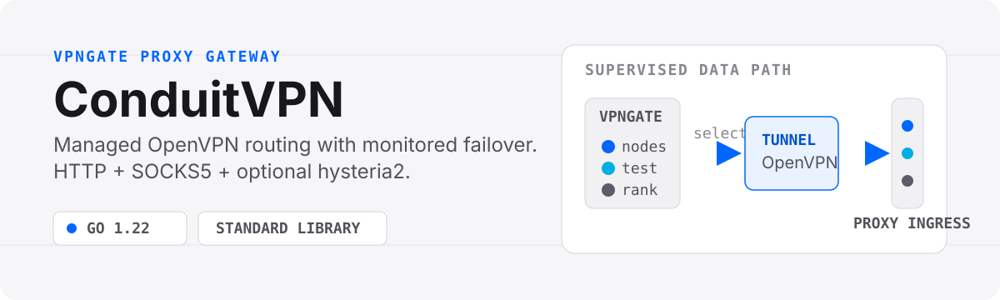
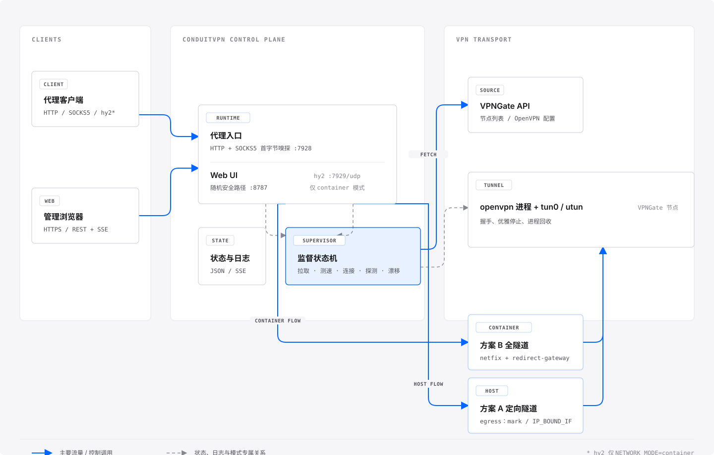

# ConduitVPN

> [English](README.md)

<p align="center">
  
</p>

**ConduitVPN** 将 [VPNGate](https://www.vpngate.net/) 公共 OpenVPN 节点转化为常驻、可管理的代理网关。它会拉取并并发测速候选节点、选择路由、监测隧道健康状态，并在节点不可用时自动漂移。单个 Go 二进制提供 HTTP、SOCKS5、可选 hysteria2 入站，以及实时 Web 管理后台。

项目是 GPL-3.0 Python 项目 aimili-vpngate 的独立 Go 重写版，基于 Go 1.22，仅使用标准库。

<p align="center">
  
</p>

## 核心能力

- **节点生命周期管理**：拉取 VPNGate 节点、并发测速、选择合格路由，并监督 OpenVPN 经历连接、探测和稳定状态。
- **VPNGate 来源容错**：可在管理后台配置镜像 origin；每轮先尝试官方源，再按顺序尝试镜像，来源暂时不可用时保留现有节点缓存。
- **来源兼容性**：兼容当前 VPNGate CSV 变体，并规避旧 IIS 镜像异常的 gzip 协商。
- **路由控制**：支持智能自动漂移、按一个或多个国家地区筛选，以及固定单节点持续重试。
- **单端口本地代理**：HTTP 和 SOCKS5 共用 `7928`；DNS、TCP 代理流量、健康探测和实时延迟测量均经由隧道。
- **双网络模式**：Docker 中使用全隧道路由；Linux/macOS 宿主机中使用受控 socket 路由。
- **可观测性**：认证后的控制台提供实时状态、延迟采样、节点管理和 SSE 日志流。
- **更小的运维面**：静态 Go 二进制、内嵌原生 Web UI、JSON 状态文件，以及零 Go 第三方依赖。

## 快速开始

推荐通过 Docker Compose 在生产环境部署。该方案使用全隧道容器模式，需要 Linux 主机、Docker Compose v2，以及可用的 `/dev/net/tun`。

```bash
git clone https://github.com/sarices/conduitvpn.git
cd conduitvpn
cp .env.example .env
```

在 `.env` 中为 `UI_PASSWORD` 和 `LOCAL_PROXY_PASS` 设置至少 16 位的强密码，然后启动网关：

```bash
docker compose up -d
docker logs conduitvpn
```

启动日志会输出随机管理路径：

```text
webui listening ... path=/0123456789abcdef01234567/ auth="login required"
```

通过本机反向代理或 Cloudflare Tunnel 访问该路径。Compose 默认仅将管理后台与 HTTP/SOCKS5 代理发布到宿主机回环地址；如需对外提供 UDP hysteria2 入站，请在 `.env` 设置 `HY2_PORT` 和 `HY2_PASSWORD`。

### 让 LLM 协助部署

将以下提示词完整复制给可操作服务器的 LLM。GitHub 代码块右上角提供一键复制；仅替换方括号中的值，不要在对话中粘贴密码、API Token 或私钥。

```text
你是一名谨慎的 Linux 与 Docker 生产环境运维工程师。请在我的 Linux 服务器上部署 ConduitVPN，仓库地址为 https://github.com/sarices/conduitvpn.git。

执行任何修改前，检查并汇报：操作系统、可用磁盘空间、Docker Engine 版本、Docker Compose v2 是否可用，以及 /dev/net/tun 是否存在。如果 Docker Compose v2 或 /dev/net/tun 不可用，停止操作并说明阻塞原因。除非我明确授权，不要安装无关软件、删除已有文件、修改宿主机路由、开放新的公网 TCP 端口、部署 Cloudflare Worker，或使用任何云端凭据。

使用 [安装目录] 作为部署目录。若该目录已存在，先检查内容；不得覆盖非 ConduitVPN 数据。以安全方式克隆或更新仓库，并使用仓库内的 docker-compose.yml 与 .env.example，不得削弱其中的安全设置。

从 .env.example 创建 .env。除非我明确要求启用 hysteria2，否则保持 NETWORK_MODE=container、UI_HOST=0.0.0.0、LOCAL_PROXY_HOST=0.0.0.0 和 HY2_PORT=0。为 UI_PASSWORD 与 LOCAL_PROXY_PASS 分别在服务器本地生成至少 32 位的随机十六进制密码，为 UI_USER 与 LOCAL_PROXY_USER 设置非默认值；密码只能写入 .env，绝不能打印、记录到日志、提交、上传或在回复中返回。保留 Compose 对 TCP 8787 和 7928 的 127.0.0.1 绑定，不得改成 0.0.0.0。

使用 Docker Compose 启动或更新服务。通过 docker compose ps 确认状态，查看近期 conduitvpn 日志是否存在启动错误，并在服务器执行 curl -fsS http://127.0.0.1:8787/healthz。从启动日志提取随机 Web 管理路径，但不得泄露任何凭据。若服务未健康，先使用只读检查诊断；执行任何破坏性操作前必须停止并征求我的确认。

完成后只返回：容器状态、健康检查结果、Web 管理 URL 路径、持久化数据目录，以及一条最小化且非破坏性的回滚命令。明确列出所有假设和未解决的阻塞项。
```

### 本地代理

隧道进入稳定状态后，将本地客户端指向 `7928` 端口：

```bash
export http_proxy="http://127.0.0.1:7928"
export https_proxy="http://127.0.0.1:7928"
curl --socks5 127.0.0.1:7928 https://api.ipify.org
```

### 无隧道体验管理后台

Demo 模式只启动带有确定性模拟数据的内嵌管理后台，不创建 VPN 隧道或代理服务：

```bash
go run ./cmd/conduitvpn --demo
```

默认账号为 `admin` / `demo`，隔离数据目录为 `./.conduitvpn-demo`。访问根路径时会重定向到生成的管理路径。

## 工作方式

<p align="center">
  
</p>

监督器独占一条隧道的生命周期：

```text
IDLE -> FETCHING -> CONNECTING -> CONNECTED -> PROBING -> STABLE
                   节点失效或路由变更 -> 拉黑 -> 选择下一个节点
```

| 模式 | 适用场景 | 路由行为 | 入站协议 |
| --- | --- | --- | --- |
| `NETWORK_MODE=container` | Docker 生产部署 | OpenVPN 接受 `redirect-gateway`；`netfix` 使用连接标记修复入站回包路由。 | HTTP、SOCKS5、可选 hysteria2 |
| `NETWORK_MODE=host` | 直接运行于 Linux 或 macOS | OpenVPN 使用 `--route-nopull`；`egress` 仅让受控 socket 经由隧道。 | 仅 HTTP 和 SOCKS5 |

两种模式下，隧道不可用时均会保护代理流量免于直连泄漏。host 模式不会修改系统默认路由：Linux 使用 socket mark 和策略路由，macOS 将受控 socket 绑定至 OpenVPN 的 `utun` 接口。

## 安全与兼容性

- 生产启动必须显式指定 `NETWORK_MODE=container` 或 `NETWORK_MODE=host`。
- 非回环地址监听的代理必须设置 `LOCAL_PROXY_USER` 与至少 16 位的密码；Docker 部署始终要求代理认证。
- 首次生产启动必须设置 `UI_USER` 与至少 16 位的 `UI_PASSWORD`。凭据以加盐 PBKDF2 哈希保存，会话 Cookie 为 HttpOnly 和 SameSite=Strict。
- 控制台位于随机 24 位十六进制路径下；生产环境的 `/` 返回 `404`。`GET /healthz` 保持无认证，以供健康检查使用。
- host 模式仅支持 Linux/macOS，创建 TUN 设备需要管理员权限，且不支持 hysteria2。
- 仅支持 IPv4 隧道。

<details>
<summary><strong>高级部署与配置</strong></summary>

### Host 模式

先安装 OpenVPN。Linux 还需要 `iproute2`；macOS 可通过 Homebrew 安装 OpenVPN。生产环境建议运行在隔离的主机或 VM 上。

```bash
CGO_ENABLED=0 go build -trimpath -o conduitvpn ./cmd/conduitvpn

sudo env NETWORK_MODE=host \
  UI_USER=admin UI_PASSWORD='a-long-random-password' \
  LOCAL_PROXY_USER=proxy LOCAL_PROXY_PASS='another-long-random-password' \
  ./conduitvpn --data-dir /var/lib/conduitvpn
```

`--data-dir` 的优先级高于 `CONDUIT_DATA_DIR`。host 模式未指定数据目录时默认为 `./data`；空目录会生成不含凭据的 `conduitvpn.env.example`。此模式请保持 `HY2_PORT=0`。

### 手动 Docker 运行

```bash
docker run -d --name conduitvpn \
  --restart unless-stopped \
  --cap-drop=ALL --cap-add=NET_ADMIN --security-opt=no-new-privileges \
  --read-only --tmpfs /tmp --device=/dev/net/tun \
  -v /data/conduitvpn:/data/conduitvpn \
  -p 127.0.0.1:8787:8787 \
  -p 127.0.0.1:7928:7928 \
  -e NETWORK_MODE=container \
  -e UI_HOST=0.0.0.0 -e UI_USER=admin -e UI_PASSWORD='a-long-random-password' \
  -e LOCAL_PROXY_HOST=0.0.0.0 -e LOCAL_PROXY_USER=proxy -e LOCAL_PROXY_PASS='another-long-random-password' \
  ghcr.io/sarices/conduitvpn:latest
```

增加 `-p 0.0.0.0:7929:7929/udp -e HY2_PORT=7929 -e HY2_PASSWORD='a-third-long-random-password'` 即可启用 hysteria2。兼容的 hysteria2 客户端使用服务端 IP、UDP 端口和密码连接，并跳过证书验证；可选 `HY2_OBFS_PASSWORD` 启用 salamander 混淆。

### 配置参考

| 分组 | 变量 |
| --- | --- |
| 运行时 | `NETWORK_MODE`、`CONDUIT_DATA_DIR`、`--data-dir`、`LOG_LEVEL` |
| 节点来源与测速 | `VPNGATE_API_URL`、`FETCH_TIMEOUT_SECONDS`、`FETCH_INTERVAL_SECONDS`、`TARGET_VALID_NODES`、`MAX_SCAN_ROWS`、`BENCH_CONCURRENCY`、`BENCH_TIMEOUT_SECONDS`；镜像 origin 通过 Web 管理后台配置 |
| 隧道与健康探测 | `CONNECT_TIMEOUT_SECONDS`、`PROBE_SETTLE_SECONDS`、`PROBE_INTERVAL_SECONDS`、`PROBE_TIMEOUT_SECONDS`、`INITIAL_PROBE_TRIES`、`HEALTH_MAX_FAILS`、`HEALTH_ADDR`、`OPENVPN_AUTH_USER`、`OPENVPN_AUTH_PASS` |
| 路由 | `ROUTE_MODE`、`ROUTE_COUNTRY`、`ROUTE_NODE`、`LATENCY_INTERVAL_SECONDS` |
| 本地代理 | `LOCAL_PROXY_HOST`、`LOCAL_PROXY_PORT`、`LOCAL_PROXY_USER`、`LOCAL_PROXY_PASS`、`LOCAL_PROXY_MAX_CONNECTIONS`、`DNS_SERVER` |
| hysteria2 入站 | `HY2_PORT`、`HY2_BIND`、`HY2_PASSWORD`、`HY2_OBFS_PASSWORD` |
| 节点拉取上游 | `OPENVPN_UPSTREAM_SOCKS`、`OPENVPN_UPSTREAM_HTTP`、`OPENVPN_UPSTREAM_USER`、`OPENVPN_UPSTREAM_PASS`、`UPSTREAM_SINGBOX_URI`、`UPSTREAM_SUBSCRIPTION`、`UPSTREAM_SINGBOX_CONFIG`、`UPSTREAM_SINGBOX_INDEX`、`UPSTREAM_SINGBOX_PORT` |
| Web 控制台 | `UI_HOST`、`UI_PORT`、`UI_USER`、`UI_PASSWORD`、`UI_TLS_CERT`、`UI_TLS_KEY` |

节点拉取可使用 HTTP/SOCKS5 上游、sing-box 单节点 URI（`vmess://`、`vless://`、`trojan://`、`ss://`、`hy2://`），或 v2ray base64、纯文本、sing-box JSON 订阅。订阅仅在启动时拉取一次。

### 管理 API

全部 API 以 `/<secret>` 为前缀。节点响应经过脱敏，不包含 OpenVPN 配置、证书或私钥。

#### VPNGate 镜像

点击管理后台顶部的齿轮图标打开 **VPNGate 镜像**，可直接粘贴从网页复制的镜像列表。前端会提取明确的 `http://` 或 `https://` 地址，去掉 `/cn/` 等路径、重复项，并整理为一行一个节点源。节点源可携带 HTTP Basic Auth userinfo，例如 `https://<密码>@mirror.example/` 或 `https://<用户名>:<密码>@mirror.example/`；凭据中的保留字符需 URL 编码。服务端会再次解析并校验 DNS，拒绝回环、私网、链路本地、保留、多播和无法解析的目标。原始文本上限为 16 KiB，镜像数量上限为 64 条。

`VPNGATE_API_URL` 仍是官方完整 API 地址，每轮始终优先请求它。镜像保存为 `scheme://[userinfo@]host[:port]`，请求时统一追加 `scheme://[userinfo@]host[:port]/api/iphone/`，其中 userinfo 会作为 HTTP Basic Auth 凭据。禁止 HTTP 重定向。保存的凭据仅保存在 `vpngate_sources.json`（权限 `0600`）中，并会从 API 响应、设置界面、日志和尝试明细中剥离。对未带凭据的同源地址直接保存会保留已有凭据；重新粘贴完整带凭据 URL 可更新凭据，删除该节点源后保存可移除凭据。只有 HTTP 200 且成功解析出至少一个有效节点的来源才算成功；整轮失败时不会中断当前隧道，也不会覆盖旧候选缓存。周期刷新使用 `FETCH_INTERVAL_SECONDS`，手动刷新和保存配置会在进行中的刷新期间合并为下一轮请求。

CSV 解析器兼容 UTF-8 BOM、表头前的元数据，以及 `Hostname`、`DDNS_HostName` 等常见列名变体；缺失主机名时会回退到已校验的节点 IP。拉取时会显式关闭 gzip 协商，以避开部分旧 IIS 镜像声明压缩但返回异常正文的问题。对于响应较慢的镜像，可将 `FETCH_TIMEOUT_SECONDS` 调高（例如 `120`）；这些兼容处理无需额外配置。

镜像列表保存于数据目录中的 `vpngate_sources.json`（权限 `0600`）。来源运行状态仅保存在内存，可通过以下认证接口查看：

| 端点 | 方法 | 用途 |
| --- | --- | --- |
| `/api/vpngate-sources` | `GET` | 查看官方源、镜像列表、最近成功来源、时间、尝试明细和刷新状态 |
| `/api/vpngate-sources` | `PUT` | 使用 `{ "text": "..." }` 整体替换镜像；空字符串清空列表。响应包含规范化后的 `mirrors`、`issues` 和 `ignored_count` |

#### 可选：Cloudflare Worker 来源代理

`cloudflare-vpngate-proxy/` 提供独立 Worker，将请求固定反向代理到一个 VPNGate API URL。默认上游是官方接口；可用 Worker 变量 `VPNGATE_API_URL` 覆盖。客户端输入不会被拼接为上游地址，因此它不是开放代理。它仅接受 `/api/iphone` 与 `/api/iphone/`，且必须通过 HTTP Basic Auth 认证。

首次部署前生成随机 Worker 名称（即 `workers.dev` 的域名前缀）和 URL 安全密码。实际名称与密码仅保存在自己的密码管理器或部署配置中，不要提交到仓库：

```bash
cd cloudflare-vpngate-proxy
WORKER_NAME="vp-$(openssl rand -hex 12)"
PASSWORD="$(openssl rand -hex 32)"

# 设置密码前，Worker 只会返回 503，不会代理请求。
wrangler deploy --name "$WORKER_NAME" --keep-vars
printf '%s' "$PASSWORD" | wrangler secret put VPNGATE_PROXY_PASSWORD --name "$WORKER_NAME"
```

将 ConduitVPN 指向受密码保护的 Worker 接口：

```env
VPNGATE_API_URL=https://<password>@vpngate-proxy.example.workers.dev/api/iphone/
```

其中 `<password>`、`vpngate-proxy` 与 `example` 均为占位符，不代表已公开的地址。`@` 前的 `<password>` 会作为 HTTP Basic Auth 用户名发送，密码字段为空。该 URL 可通过 `VPNGATE_API_URL` 配置，也可直接粘贴到 **VPNGate 镜像** 中作为带密码的备用节点源。ConduitVPN 会从来源状态和日志中剥离 URL userinfo。随机 Worker 名称只能降低被随意扫描的概率，密码才是访问控制；如需更严格策略，可额外使用 Cloudflare Access 或 WAF。

| 端点 | 方法 | 用途 |
| --- | --- | --- |
| `/api/state` | `GET` | 当前网关状态 |
| `/api/nodes` | `GET` | 脱敏节点列表 |
| `/api/route` | `GET`、`PUT` | 读取或设置自动、国家地区、固定节点路由 |
| `/api/blacklist` | `GET` | 黑名单节点 |
| `/api/logs`、`/api/logs/stream` | `GET`、`GET` SSE | 最近日志和实时日志流 |
| `/api/actions/update-nodes` | `POST` | 立即拉取并测速 |
| `/api/actions/test-blacklist` | `GET`、`POST` | 查询或启动隔离黑名单验证 |
| `/api/actions/restore-available-blacklist` | `POST` | 恢复已验证可用的节点 |
| `/healthz` | `GET` | 无认证健康检查 |

```bash
# 将自动选择限制为日本和韩国。
curl -X PUT -H 'Content-Type: application/json' \
  -d '{"mode":"country","country":"JP,KR"}' \
  http://127.0.0.1:8787/<secret>/api/route

# 锁定节点，然后切回智能路由。
curl -X PUT -d '{"mode":"fixed","node":"vpn104003570"}' \
  http://127.0.0.1:8787/<secret>/api/route
curl -X PUT -d '{"mode":"auto"}' \
  http://127.0.0.1:8787/<secret>/api/route
```

</details>

## 开发

Makefile 在临时 `golang:1.22-alpine` 容器中运行 Go 工具链，因此宿主机无需安装 Go。

```bash
make build
make test
make vet
```

GitHub Actions 会在 Linux 和 macOS 上执行 vet 与测试，构建 `linux/amd64`、`linux/arm64` 多架构镜像，并在版本标签上附加静态二进制文件。

## 已知边界

- 黑名单不会自动过期，重启后仍然生效。
- 固定节点持续不可用时会一直重试，这是既定语义。
- 上游代理可用性取决于其来源 IP 白名单策略。
- 订阅只会在启动时拉取一次。

## 许可证

GPL-3.0，承袭原 aimili-vpngate 项目。
